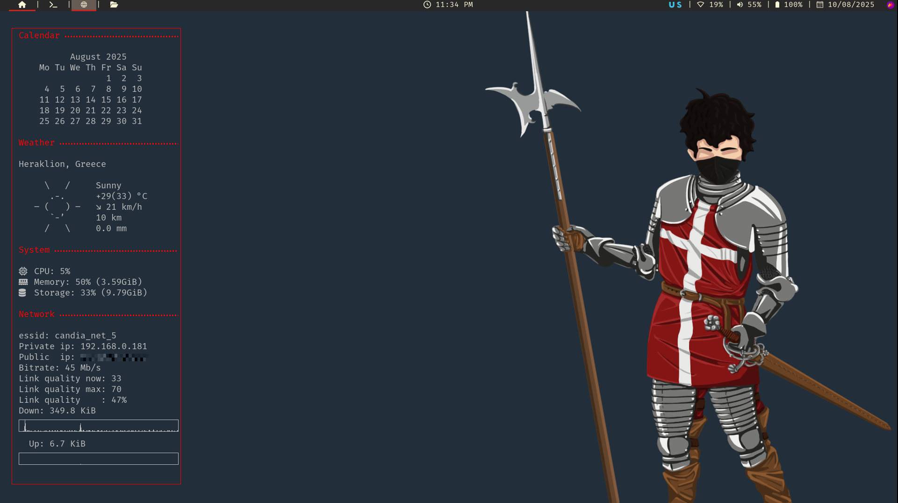

    <h1>Dotfiles</h1>

> [!NOTE]
> I commissioned this wallpaper from 
> [vvizardbone](https://www.instagram.com/vvizardbone/).
> The weapons displayed are *real* historical arms housed in museums.

## About This Repository

> [!CAUTION]
> My configs may cause undesirable effects on other systems. Make sure you read
> and understand every file you use and modify it to suit your needs.

The purpose of this repository is to house my personal configurations of the 
software I use. In the following sections I will describe the **values** of 
engineering and the **goals** of this project.

### Clean Code Principles

I value systems that are **modular**, **maintainable** and **scalable** and 
that's why I prefer to break up my configs to small files with sections as 
opposed to monolithic giant files. I also try to write programs that are as
**readable** and **predictable** so they can be understood and **maintained**.

To minimize the configuration directories generated by the software I use, the
[XDG base directory 
specification](https://wiki.archlinux.org/title/XDG_Base_Directory) is followed 
as it can be seen in my `.bashrc`

> [!NOTE]
> Even though I put an emphasis to **modularity** to this setup I haven't taken
> into consideration:
> * Multiple shells (I don't use anything other than bash because they are not 
> used in the industry)
> * Multiple monitors in different configurations (I believe it would be very 
> difficult to write generic code to cover this so I try to make my configs as 
> customizable as possible)

### Minimalism

I value **minimal**, **elegant** software that **performs well**, works **in
conjunction** with other programs and use **text** as an interface (basically
the values that describe the [Unix
philosophy](https://en.wikipedia.org/wiki/Unix_philosophy)). Based on this
philosophy I can avoid **bloated**, **large** and **convoluted** software. Also 
(most of the time) minimal software allows me build **efficient** workflows.

So in summary I want software that:
* uses CPU and memory efficiently
* has a CLI or TUI interface (over GUI applications)
* has keyboard-centric control (using vim keybinds)
* is scriptable

### Privacy And Security

I value secure, [Free](https://www.gnu.org/philosophy/free-sw.html) and [Open
Source](https://opensource.org/osd) software. Well engineered secure software
will preserve my **freedom**, **privacy** and **independence** from any
vendor/company that decides to control data and/or spy on me for profit.

### Reproducibility

I value a setup that is **hardware and distro agnostic**. I believe that have 
this kind capability will show it's benefits when I decide to migrate to other 
machines and/or Linux distributions. At first I planed to implement this with
primitive basic tools (bash, git, stow, rsync, cron) but I'm in the process of
learning and using [Ansible](https://www.redhat.com/en/ansible-collaborative), 
an automation tool used in the industry.

## Unimplemented Features And Fixes

* fallback fonts
* GPU generated graphics
* Bluetooth support (status bar module)
* Ethernet support (status bar module)
* various TODO and FIX comments are scattered in some configs

## Programs Overview

Check marks indicate if configs are included in this repo for the program listed.

### General

|                        | Link                                                  | Config             |
| ---------------------- | ----------------------------------------------------- | ------------------ |
| GNU/Linux Distribution | [Arch](https://archlinux.org/)                        |                    |
| Display Server         | [X11](https://www.x.org/wiki/)                        | :white_check_mark: |
| Shell                  | [GNU Bash](https://www.gnu.org/software/bash/)        | :white_check_mark: |
| Version Control        | [Git](https://git-scm.com/)                           | :white_check_mark: |
| Color Scheme           | [Gruvbox](https://github.com/morhetz/gruvbox)         |                    |
| Font                   | [Fira Mono](https://www.nerdfonts.com/font-downloads) |                    |

### Interface

| Program                   | Link                                                                     | Config             |
| ------------------------- | ------------------------------------------------------------------------ | ------------------ |
| Tiling Window Manager     | [i3wm](https://i3wm.org/)                                                | :white_check_mark: |
| Status Bar                | [Polybar](https://github.com/polybar/polybar?tab=readme-ov-file)         | :white_check_mark: |
| Application Launcher      | [Rofi](https://github.com/davatorium/rofi)                               | :white_check_mark: |
| System Monitor And Widget | [Conky](https://github.com/brndnmtthws/conky?tab=readme-ov-file)         | :white_check_mark: |
| Background Browser        | [Nitrogen](https://github.com/l3ib/nitrogen/)                            |                    |
| Login Manager             | [Ly](https://github.com/fairyglade/ly)                                   |                    |
| Lock Screen               | [Betterlockscreen](https://github.com/betterlockscreen/betterlockscreen) |                    |
| Notification Deamon       | [Dunst](https://github.com/betterlockscreen/betterlockscreen)            | :white_check_mark: |

### Applications

| Program                | Link                                                | Config             |
| ---------------------- | --------------------------------------------------- | ------------------ |
| Primary Browser        | [Brave](https://brave.com/)                         |                    |
| Secondary Browser      | [Firefox](https://www.mozilla.org/en-US/)           |                    |
| Privacy Browser        | [Tor](https://www.torproject.org/?noredirect=1)     |                    |
| Terminal Emulator      | [Alacritty](https://github.com/alacritty/alacritty) | :white_check_mark: |
| Text Editor            | [NeoVim](https://neovim.io/)                        | :white_check_mark: |
| Graphical File Manager | [Nemo](https://github.com/linuxmint/nemo)           |                    |
| Password Manager       | [KeePassXC](https://keepassxc.org/)                 |                    |
| Document Viewer        | [Zathura](https://pwmt.org/projects/zathura/)       | :white_check_mark: |

### Applications I Don't Use

I use the browser instead of these standalone programs.

| Program                | Link                                                      |
| ---------------------- | --------------------------------------------------------- |
| Email Client           | [Mutt](http://www.mutt.org/)                              |
| Media Player           | [Mpv](https://mpv.io/)                                    |
| Communication Platform | [Discord](https://discord.com/)                           |
| Calculator             | [Gnome Calculator](https://apps.gnome.org/en/Calculator/) |

<!--
## Key Bindings

* Not yet documented

## Setup Installation

* For information on how to reproduce my system visit my [system reproducibility]() repository
-->

## Contributing

You are free to submit pull requests and open issues for improvements and/or fixes.
