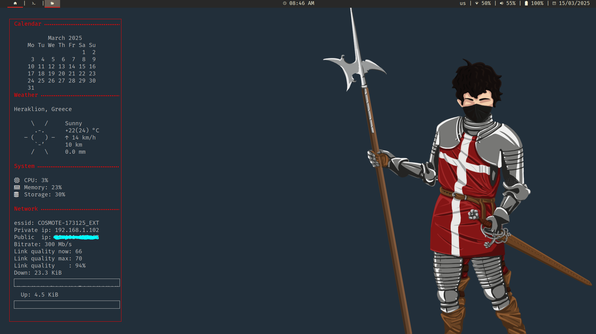

  <h1>dotfiles</h1>

## Table Of Contents

* [Description](#Description)
* [Programs Overview](#Programs-Overview)
* [Key Bindings](#Key-Bindings)
* [Setup Installation](#Setup-Installation)

## Description

This is a collection of my configurations for a minimal, keyboard-centric
setup. 

> [!CAUTION]
> My configs may cause undesirable effects on other systems. Make sure you read
> and understand every file you use and modify it to suit your needs.

### Features

1. Keyboard-centric
1. Minimal software
1. Minimal use of resources (cpu, memory)
1. Follows the XDG base directory specification
1. Reproducible to other devices

### Features Not Yet Implemented

1. Hardware agnostic or modular
    * Apply configs to any desktop or modify variables specific to the device
1. Distro agnostic
    * Choose any distribution and deploy the configs via script
1. Multi-monitor
    * Extend the configs to suit your monitor setup
1. Multi-shell
    * Add and use any shell of your liking while having \"global\" shell 
    configuration
1. Fallback fonts
    * The fonts installed are not yet taken in to consideration

## Programs Overview

Checkmarks indicate if configs are included in this repo for the program listed.

### General

| Program                | Link                                                  | Config             |
| ---------------------- | ----------------------------------------------------- | ------------------ |
| GNU/Linux Distribution | [Arch](https://archlinux.org/)                        |                    |
| Display Server         | [X11](https://www.x.org/wiki/)                        |                    |
| Color Scheme           | [gruvbox](https://github.com/morhetz/gruvbox)         |                    |
| Font                   | [Fira Mono](https://www.nerdfonts.com/font-downloads) |                    |
| Shell                  | [GNU Bash](https://www.gnu.org/software/bash/)        | :white_check_mark: |

### Interface

| Program                   | Link                                                                     | Config             |
| ------------------------- | ------------------------------------------------------------------------ | ------------------ |
| Tiling Window Manager     | [i3wm](https://i3wm.org/)                                                | :white_check_mark: |
| Status Bar                | [polybar](https://github.com/polybar/polybar?tab=readme-ov-file)         | :white_check_mark: |
| Application Launcher      | [rofi](https://github.com/davatorium/rofi)                               | :white_check_mark: |
| System Monitor And Widget | [conky](https://github.com/brndnmtthws/conky?tab=readme-ov-file)         | :white_check_mark: |
| System Tray               | [tbd]()                                                                  |                    |
| Login Manager             | [ly](https://github.com/fairyglade/ly)                                   |                    |
| Notification Deamon       | [dunst](https://github.com/dunst-project/dunst)                          |                    |
| Background Browser        | [nitrogen](https://github.com/l3ib/nitrogen/)                            |                    |
| Lockscreen                | [betterlockscreen](https://github.com/betterlockscreen/betterlockscreen) |                    |

### Applications

| Program                | Link                                               | Config             |
| ---------------------- | -------------------------------------------------- | ------------------ |
| Primary Browser        | [brave](https://brave.com/)                        |                    |
| Secondary Browser      | [firefox](https://www.mozilla.org/en-US/)          |                    |
| Terminal Emulator      | [alacritty](https://github.com/alacritty/alacritty)| :white_check_mark: |
| Text Editor            | [neovim](https://neovim.io/)                       | :white_check_mark: |
| Graphical File Manager | [nemo](https://github.com/linuxmint/nemo)          |                    |
| Password Manager       | [KeePassXC](https://keepassxc.org/)                |                    |

### Applications I Don't Use

1. Email Client    (browser mail clients instead of [mutt](http://www.mutt.org/))
1. Media Player    (browser media player instead of [mpv](https://mpv.io/))
1. Discord         (discord website instead of [discord](https://discord.com/))
1. Document Viewer (browser document viewer instead of [zathura](https://pwmt.org/projects/zathura/))
1. Calculator      (googling calculations instead of [gnome calculator](https://apps.gnome.org/en/Calculator/))

## Key Bindings

* Not yet documented

## Setup Installation

* For information on how to reproduce my system visit my [system reproducibility]() repository

