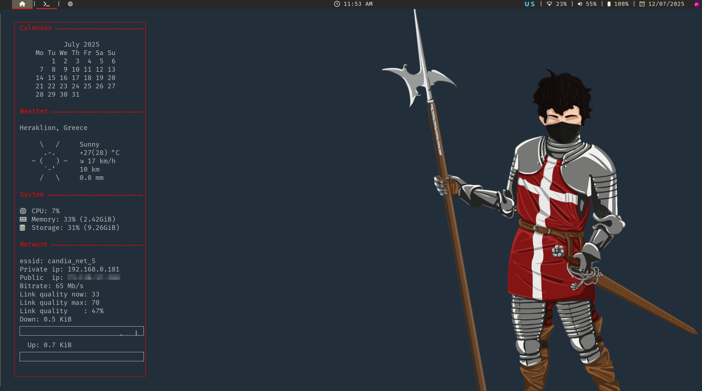

    <h1>Dotfiles</h1>

> [!NOTE]
> I commissioned this wallpaper from 
> [vvizardbone](https://www.instagram.com/vvizardbone/).

## Table Of Contents

* [Description](#Description)
* [Programs Overview](#Programs-Overview)
* [Key Bindings](#Key-Bindings)
* [Setup Installation](#Setup-Installation)

## Description

> [!CAUTION]
> My configs may cause undesirable effects on other systems. Make sure you read
> and understand every file you use and modify it to suit your needs.

### Features

1. Keyboard-centric
1. Minimal software
1. Minimal use of resources (cpu, memory)
1. Follows the XDG base directory specification
1. Reproducible to other devices

### Features Not Yet Implemented

1. Hardware agnostic or modular
    * Apply configs to any desktop or modify variables specific to the device
1. Distro agnostic script
    * Choose any distribution and deploy the configs via script
1. Multi-monitor
    * Extend the configs to suit your monitor setup
1. Multi-shell
    * Add and use any shell of your liking while having \"global\" shell 
    configuration
1. Fallback fonts
    * The fonts installed are not yet taken in to consideration

## Programs Overview

Check marks indicate if configs are included in this repo for the program listed.

### General

|                        | Link                                                  | Config             |
| ---------------------- | ----------------------------------------------------- | ------------------ |
| GNU/Linux Distribution | [Arch](https://archlinux.org/)                        |                    |
| Display Server         | [X11](https://www.x.org/wiki/)                        | :white_check_mark: |
| Shell                  | [GNU Bash](https://www.gnu.org/software/bash/)        | :white_check_mark: |
| Version Control        | [Git](https://git-scm.com/)                           | :white_check_mark: |
| Color Scheme           | [Gruvbox](https://github.com/morhetz/gruvbox)         |                    |
| Font                   | [Fira Mono](https://www.nerdfonts.com/font-downloads) |                    |

### Interface

| Program                   | Link                                                                     | Config             |
| ------------------------- | ------------------------------------------------------------------------ | ------------------ |
| Tiling Window Manager     | [i3wm](https://i3wm.org/)                                                | :white_check_mark: |
| Status Bar                | [Polybar](https://github.com/polybar/polybar?tab=readme-ov-file)         | :white_check_mark: |
| Application Launcher      | [Rofi](https://github.com/davatorium/rofi)                               | :white_check_mark: |
| System Monitor And Widget | [Conky](https://github.com/brndnmtthws/conky?tab=readme-ov-file)         | :white_check_mark: |
| Background Browser        | [Nitrogen](https://github.com/l3ib/nitrogen/)                            |                    |
| Login Manager             | [Ly](https://github.com/fairyglade/ly)                                   |                    |
| Lock Screen               | [Betterlockscreen](https://github.com/betterlockscreen/betterlockscreen) |                    |
| Notification Deamon       | [Dunst](https://github.com/betterlockscreen/betterlockscreen)            | :white_check_mark: |

### Applications

| Program                | Link                                               | Config             |
| ---------------------- | -------------------------------------------------- | ------------------ |
| Primary Browser        | [Brave](https://brave.com/)                        |                    |
| Secondary Browser      | [Firefox](https://www.mozilla.org/en-US/)          |                    |
| Terminal Emulator      | [Alacritty](https://github.com/alacritty/alacritty)| :white_check_mark: |
| Text Editor            | [NeoVim](https://neovim.io/)                       | :white_check_mark: |
| Graphical File Manager | [Nemo](https://github.com/linuxmint/nemo)          |                    |
| Password Manager       | [KeePassXC](https://keepassxc.org/)                |                    |

### Applications I Don't Use

I use the browser instead of these standalone programs.

| Program                | Link                                                      |
| ---------------------- | --------------------------------------------------------- |
| Email Client           | [Mutt](http://www.mutt.org/)                              |
| Media Player           | [Mpv](https://mpv.io/)                                    |
| Communication Platform | [Discord](https://discord.com/)                           |
| Document Viewer        | [Zathura](https://pwmt.org/projects/zathura/)             |
| Calculator             | [Gnome Calculator](https://apps.gnome.org/en/Calculator/) |

## Key Bindings

* Not yet documented

## Setup Installation

* For information on how to reproduce my system visit my [system reproducibility]() repository

